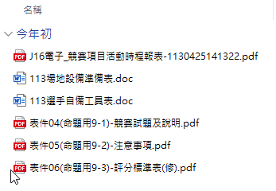
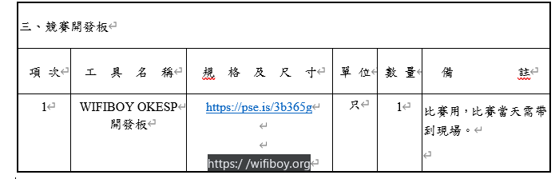
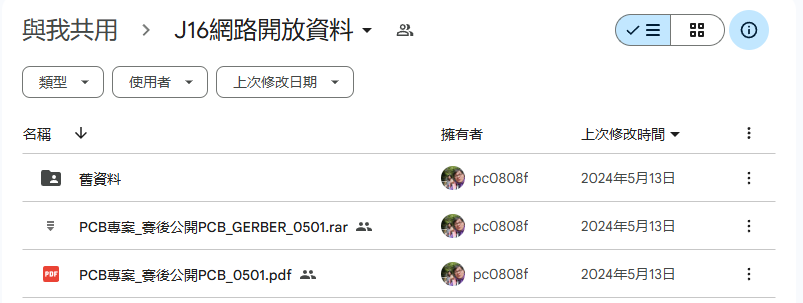
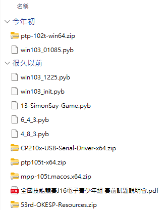
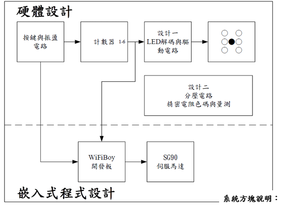

# 01.使用 WiFiBoy 玩學機來學物聯網應用

## 前言

今年我們會針對最近 WiFiBoy Python IoT 2024 版的硬體與 MicroPython 1.23 版的新增功能進行介紹。

前十天會對於硬體、開發環境與 MicroPython 基礎語法與模組進行介紹，並帶著您試著完成一個叫做 Simon Says 的小遊戲。
第二個十天，我們會介紹一些有趣的硬體擴充模組，帶著您用玩學機來做一些有趣的小專案。
最後十天，我們會介紹藍芽通訊、RS485通訊、網頁伺服器與遠端控制功能等實務性專案，讓您的玩學機可以變成一台每日都會用到的小工具。

## 第54屆全國技能競賽J16電子組比賽簡介

全國技能競賽是一年一度技職學校最盛大的競賽活動。各職類的選手都是通過校內選拔、分區競賽後脫穎而出的選手。經過指導老師的辛勤指導與選手刻苦練習的過程，才能參加每年在南港展覽館的全國賽。最近在準備鐵人賽文章的過程中，發現技檢中心已經有把相關的競賽資料公告上網。藉由此機會，讓我來為大家介紹目前對於 WiFiBoy Python 玩學機最多介紹的官方競賽說明文件。

* [技能檢定中心的公開資料](https://www.wdasec.gov.tw/News_Content.aspx?n=BE1CD914D1A8176B&sms=FDDD385F34312990&s=E43E3D1FC2D073FD)

請各位用搜尋的方式，找到關鍵字 **54-J16電子**，您會看到有一份 [Zip 壓縮檔](https://ws.wda.gov.tw/Download.ashx?u=LzAwMS9VcGxvYWQvMzMxL3JlbGZpbGUvMTAyNTAvMTcwMTM2L2M3N2JjMWM3LTkxZGQtNDUzMi04ZjhmLWM0YTA2OWZhN2U4My56aXA%3d&n=NTQtSjE26Zu75a2QLnppcA%3d%3d)
請將其下載到電腦。

在解壓縮後的目錄中，有一份檔案「113選手自備工具表.doc」您很容易就會忽略，裡面有個連結很重要 **[https://pse.is/3b365g](https://pse.is/3b365g)**，請透過下載我們這個課程會用到的相關工具。 GoogleDrive 裡面是 J16 電子組比賽會用到的工具與參考資料。

簡單介紹裡面的檔案主要的功能

1. ptp-102t-win64.zip WiFiBoy Python 玩學機搭配的積木編輯環境
2. win103_01085.pyb	用積木程式寫成的簡易俄羅斯方塊畫面
3. 4_8_3.pyb 積木程式寫成的小龜畫圖程式，操作畫面畫出 8-5 = 3
4. 6_4_3.pyb 積木程式寫成的小龜畫圖程式，操作畫面畫出 6-4 = 2
5. 13-SimonSay-Game.pyb 積木程式編寫的 Simon Says 遊戲
6. 53rd-OKESP-Resources.zip 第53屆全國技能競賽 WiFiBoy 玩學機教育訓練資料
7. CP210x-USB-Serial-Driver-x64.zip CP210x驅動程式
8. mmp-105t.macos.x64.zip	MacOS 用新版的玩學機積木編輯環境
9. ptp105t-x64.zip	Windows 用新版的玩學機積木編輯環境		
10. win103_1225.pyb	用積木程式寫成的簡易俄羅斯方塊畫面(方格狀)
11. win103_init.pyb 用積木程式寫成的簡易俄羅斯方塊畫面(初始畫面)
12. 全國技能競賽J16電子青少年組賽前試題說明會

我們打開 **全國技能競賽J16電子青少年組賽前試題說明會** 來體會競賽選手的學習過程。

1. 透過賽前的說明會，可以了解 WiFiBoy 玩學機的基礎操作(100分鐘)
2. 硬體設計 

WiFiBoy 教育訓練的簡報在 **53rd-OKESP-Resources\第53屆全國技能競賽J16開發板與開發環境說明.pdf**

準備好工具，明天開始，我們就來教大家認識新版的 WiFiBoy Python IoT 玩學機。