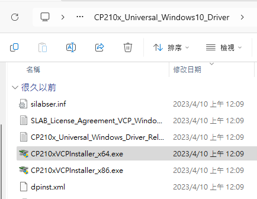
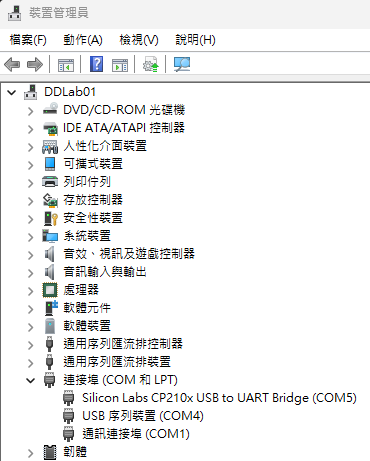
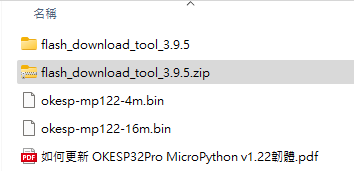
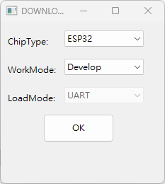
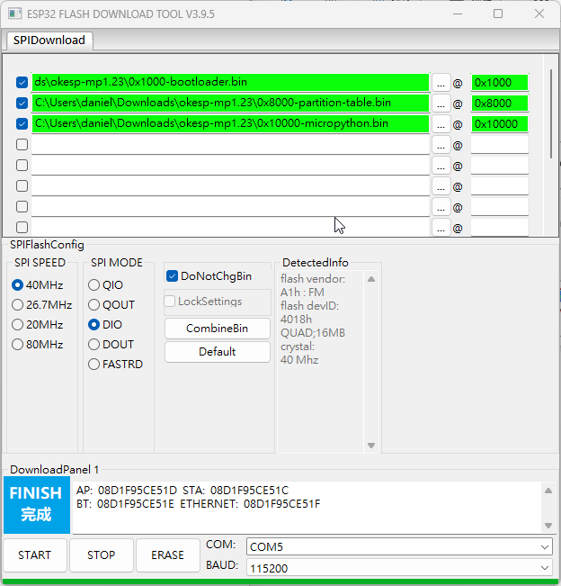

# 02.WiFiBoy Python IoT 硬體簡介

## 前言

過去的 WiFiBoy Python IoT 只有 4MB ，放入一些字型與圖片就會不夠用，而 2024 版則是推出了具有更大儲存空間的 16 MB 版本。我們可以更自由地將各種範例程式、開機畫面與展示圖片放到這個 Flash 空間中。

## 設備與軟體需求清單

1. 一台執行 Windows 、 MacOS 或 Linux 系統桌機或筆電
2. 一台 2024 年版的 WiFiBoy Python IoT 玩學機
3. [USB CP210x 晶片驅動程式]()
4. [樂鑫公司提供針對 ESP 系列晶片的燒錄程式 Flash Download Tools 3.9.5](https://www.espressif.com/sites/default/files/tools/flash_download_tool_3.9.5.zip)
5. [WiFiBoy 提供的 MicroPython 1.23 版韌體](https://wifiboy.org/okesp-mp123.zip)

## 安裝驅動程式

先解壓縮之前下載的 CP210x USB晶片驅動程式，您會看到類似下圖的畫面。

執行 **CP210xVCPInstaller_x64.exe** (範例電腦是 Win11 64位元的作業系統) ，安裝驅動程式。安裝完後，在您系統的裝置管理員中應該會看到新增了一個 USB 裝置，本例為 **COM5**。請記下這個代號，未來與玩學機連線時會用到。

## 練習燒錄新版韌體

開啟 **Flash Download Tools 3.9.5**，您會看到一個選擇晶片的畫面，請選擇 **ESP32**，WorkMode 請選擇 **Develop**。

請先設定 COM 埠位置與連線速度

本例是連接到 **COM5** ，燒錄速度(BAUD)設定為 **1152000**。

接著請指定每個 bin 檔路徑與要燒錄的位址，燒錄前請先做一次 Earse Flash 的動作，確保可正常燒錄。Earse 的時間約十秒。

Earse 完成後，請點選 **START** 開始進行韌體更新。出現完成後，請關閉 WiFiBoy 電源後再開機，您應該就能看到開機畫面更新為 **v1.23** 的訊息。

## 測試硬體功能

我們這個時候可以進行一些內建功能測試。

1. 壓住右邊的黃色按鈕，然後按下 **RESET** 鍵，應該會叫出一個類似小蜜蜂的遊戲。請自行試玩。
2. 壓住右邊的藍色按鈕，然後按下 **RESET** 鍵，應該會叫出一個「NeoPixel Ring Dice」訊息，應該會聽到一個類似電子骰子搖動的音效。
3. 壓住左邊的紅色按鈕，然後按下 **RESET** 鍵，螢幕畫面應該會多增加一行小字，寫著 **UID = V35C-E51C**(這是作者機器的代碼) 的字樣。
4. 壓住左邊的綠色按鈕，然後按下 **RESET** 鍵，應該會叫出一個畫圖程式，透過機身的搖動，會在 LCD 上畫出圖案，使用左邊的四個顏色按鈕，可切換不同顏色。

硬體功能如果都測試正常，那麼明天開始我們裝好開發環境，就能進行物聯網程式學習。

