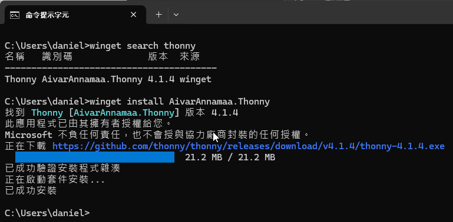
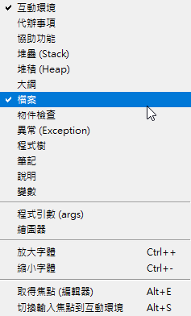

# 03. 開發環境簡介使用 Thonny

## 設備需求清單

1. 一台執行 Windows 、 MacOS 或 Linux 系統桌機或筆電
2. 一台 2024 年版的 WiFiBoy Python IoT 玩學機

## 如何安裝 Thonny

如果您是使用 Windows 11 的電腦，您可以試著使用 **Winget** 這套微軟提供的軟體套件安裝工具。開啟您的命令提示字元，就可以用一條指令的方式自動安裝我們需要用到的 **Thonny** 軟體。

1. 找尋套件庫是否有 **Thonny** 這個軟體的關鍵字


2. 安裝 **Thonny**，使用 `winget install AivarAnnamaa.Thonny` 這個指令來安裝軟體。



## 第一次進入軟體請先進行設定

先注意軟體介面的右下角，選定您玩學機的連接埠，依本例，您應該會看到 COM5，我們的玩學機是 ESP32 晶片，所以請您選擇 **「MicroPython(ESP32) . CP2104 USB to UART Bridge Controller @ COM5」**


然後設定 **檢視** 中的選項，開啟 **檔案**，這樣才會叫出檔案管理員，方便檢視或上下傳檔案到玩學機中。



點選 **工具** / **選項**


然後切換到 **直譯器** 標籤，您會看到我們的連接埠是接到 **COM5**。另外值得一提的部份是右下角有個 **「安裝或是更新 MicroPython (esptool)(UF2)」** 的連結，請不要直接執行這個動作，這是設計給一般 EPS32 相容版的模組使用，僅會下載通用版的 MicroPython 環境。而不是給 WiFiBoy Python 玩學機用的版本。如果用了此版本，會有下列一些問題:

1. 無法直接驅動 LCD 螢幕
2. 鍵盤電路對應不一致無法使用
3. 沒有內建的 WiFiBoy 圖形繪製引擎
4. 沒有內建的 ToneEngine 模組
   等等功能。


如果真的不幸誤操作，請按照第二天燒錄韌體的方法，重新燒錄，即可正常使用。

點選底下的 **互動環境**，您可以直接在此處輸入指令。請先輸入 `help('modules')`，會請 MicroPython 環境印出系統內內建的模組。


## 檔案存檔與存檔位置說明

您可以試著開啟一個新檔，輸入 `help('modules')`後，選擇存檔。此時會出現這個提示訊息:


剛開始學習物聯網程式開發的新手常會搞不清楚程式碼是存在開發機(個人電腦)或在嵌入式設備(玩學機)上?我們先選擇存在 **MicroPython 設備** (就是玩學機)，設定一個檔名，例如叫做 **hello.py**。


另外又開啟一個新檔，也輸入同樣的指令，然後存在本機上。如同下圖的操作。


此時觀察兩個檔案上面的標籤，您會發現有些不同:


1. 存在玩學機上的檔名是 **[hello.py]**
2. 存在電腦主機上的檔名是 **hello.py**

也就是說 Thonny 會用 **中括號** 來標示存放在嵌入式設備中的檔案，讓你好區分。

## 套件搜尋功能

Thonny 具有 Python 套件搜尋與安裝功能，方便開發這來安裝相關套件。

我們先開啟 **工具/管理套件**


在搜尋輸入列中，輸入 **DHT11** 這個關鍵字，DHT11 是後面我們會用到的一個溫溼度感測器。


查看搜尋結果，我們可以看到有兩個模組。其中有用 **@micropython-lib** 字樣標示的，就是可以給 MicroPython 環境用的模組。 


## 繪圖器功能

Thonny 內有內建一個繪圖器，您可以將遷入式設備產生的連續數值或是外界傳入的連續數值進行畫圖，讓您方便觀察。

請開啟 **檢視**，勾選底下的 **繪圖器**。


然後參照我們提供程式碼，貼上後執行，即可看到類似底下動畫的執行結果。


## 程式碼

```
from time import sleep
import math

angle = 0
Radius = 1
while True:
    rad = math.radians(angle)
    sin_arc = math.sin(rad)
    y = round((Radius * sin_arc), 3)
    print(-1.5, y, 1.5)
    sleep(0.05)
    angle = angle + 10
    if angle >= 360:
        angle = 0
```

## 參考資料

1. [使用 winget 工具來安裝和管理應用程式](https://learn.microsoft.com/zh-tw/windows/package-manager/winget/)
2. [使用Thonny Python IDE編寫MicroPython程式（一）：連接開發板以及燒錄MicroPython韌體](https://swf.com.tw/?p=1477)