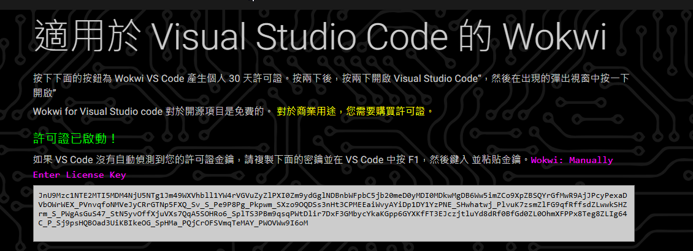

# 04. 開發環境簡介使用 MicroSoft Code

## 前言

MicroSoft Code 是一款跨平台的文字編輯器。您可以透過它內建的擴充元件市場，安裝特定的擴充套件，讓其變成一套功能強大的整合式開發工具。最近也有一些開發者，開始針對 ESP32 晶片與 MicroPython 環境提供相關的工具，不過使用起來比較麻煩一些。提供資訊給各位讀者參考。

## 設備需求清單

1. 一台可上網的桌機或筆電

## 安裝 MicroSoft Code

開啟命令提示字元執行 `winget search vscode`

執行 `winget install Microsoft.VisualStudioCode`，即可安裝完成

## 第一次的設定

請按 `Ctrl + Shift + x`，開啟延伸模組功能。一次安裝底下這幾個必要的套件:

1. 關鍵字搜尋 `chinese`，會找到 **Chinese (Traditional) Language Pack for Visual Studio Code** 套件，請安裝它，然後重新啟動 vscode，這樣你會把 vscode 的操作介面變成繁體中文環境。

2. 關鍵字搜尋 `python`，會找到 **Python** 與 **Python Debugger** 套件，請安裝它。搭配電腦上的 Python 直譯器，您可以利用 vscode 進行 Python 程式開發。

## 介紹幾個社外掛套件

1. 關鍵字搜尋 `PlatformIO IDE`，會找到 **PlatformIO IDE** 套件。這是一個功能強大的嵌入式開發環境，但功能過於複雜，有興趣的讀者可以自行搜尋資料學習。

2. 關鍵字搜尋 `RT-Thread MicroPython`，會找到 **RT-Thread MicroPython** 套件。這是支援一些大陸公司開發版的擴充套件。

3. 關鍵字搜尋 `MicroPico`，會找到 **MicroPico** 套件。這是最近一個支援 Raspberry Pi Pico、ESP32 晶片的程式開發外掛，還在發展中值得期待。

## 線上硬體模擬器 Wokwi

為什麼要模擬器?您可以參考 STEAM 上的一個很有趣的遊戲「[**Electrician Simulator - First Shock**](https://store.steampowered.com/app/1781160/Electrician_Simulator__First_Shock/)」，讓您可以透過遊戲，體會水電工解決家庭電路故障的過程。

當老師與學生手邊沒有硬體，或是在外進行教學時，如果有模擬器環境，就可更方便的在手機與平板上進行教學。這幾年很多有在教 Arduino 硬體課程的中小學校教師會使用 [Wokwi 線上電路模擬器](https://wokwi.com/)這個工具。目前 Wokwi 也有在開發給 vscode 的擴充套件，不過可惜的事情是，要非線上使用與進行一些編輯，需要申請付費帳號。

關鍵字搜尋 `Wokwi`，會找到 **Wokwi Simulator** 套件。可以讓你整合 Wokwi 功能到您的 VSCode 環境中。

## 使用帳號登入

1. 您可以使用您的 Gmail 帳號或是 Github 帳號登入到 **wokwi** 網站

2. 但使用 Vscode 來離線開發算是進階功能，需要額外付費，可以先用試用版序號試試看。

3. 申請試用序號

4. 還沒加上序號

5. 按下 **F1** 鍵叫出 vscode 的指令功能，輸入關鍵字

6. 貼上您的授權後，軟體就可以使用。

7.  比較一下線上版與離線版的差異

## 結語

為了照顧廣大的讀者，我們後續的課程還是選擇 **Thonny** 開發環境作為主要的教學平台，大家明天見。

## 程式碼

本日無程式碼

## 參考資料

1. [MicroPico](https://github.com/paulober/MicroPico)
2. [PlatformIO IDE](https://platformio.org/platformio-ide)
3. [RT-Thread MicroPython](https://github.com/RT-Thread-packages/micropython/blob/master/README_ZH.md)
4. [Electrician Simulator - First Shock](https://store.steampowered.com/app/1781160/Electrician_Simulator__First_Shock/)
5. [Wokwi 文件](https://docs.wokwi.com/guides/micropython)