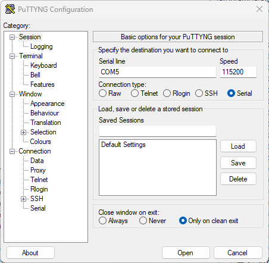
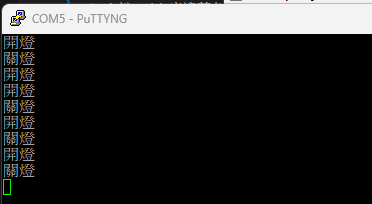
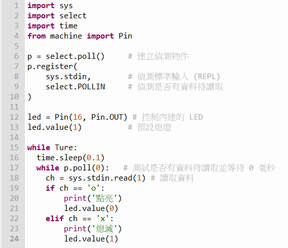

# 08.鍵盤輸入讀取與應用

## 複習一下去年的課程內容

去年鐵人賽有介紹如何取得 WiFiBoy 的按鍵值，有興趣的學員可以查閱這篇文章[06.鍵盤輸入值讀取與應用](https://ithelp.ithome.com.tw/articles/10315353)。

簡單複習一下重要的按鍵組合:

玩學機內建的按鍵定義值規則如下:

* A 鍵(右半邊藍色按鈕): 1
* B 鍵(右半邊藍色按鈕): 2
* 右鍵Right(左半邊紅色按鈕): 4
* 左鍵Left(左半邊綠色按鈕): 8
* 下鍵Down(左半黃色按鈕): 16
* 上鍵Up(左半邊藍色按鈕): 32
* 選單鍵Menu(右半邊綠色按鈕): 64

1. 取得的按鍵值是每個按鍵是否按下去的鍵值總和(按下去就是對應鍵值，放開則對應0)。例如按下 A 鍵，讀到的數值是 1。按下左鍵，讀到的值是8。
2. 如果同時按下A鍵和B鍵，則讀到 1 + 2 = 3 值。因為 A= 1, B=2，相加為3。

## 程式碼

### 透過取得使用者按鍵值來判斷是否開關內建的 LED 燈

```
import machine, sys, select
led = machine.Pin(16, 3)
led.value(1)			# 預設關閉內建LED 
time.sleep(1)			# 要延時一秒鐘，否則一直按著按鍵開機，會進入到預設的應用程式
while True:
    a = wb.getkey()		# 判斷使用者是按哪個鍵
    if a == 1:			# 按 A 鍵
        led.value(0)	# 開燈
    elif a == 2:		# 按 B 鍵
        led.value(1)	# 關燈
    elif a == 64:		# 按 MENU 鍵
        led.value(1)	# 關燈
        print('離開程式')
        break
```

### 主機鍵盤輸入，透過 UART 介面，下指令給 WiFiBoy 玩學機，控制 LED 亮滅

因為我們使用 Thonny 開發程式，會佔住 UART 介面。因此如果要讓其他程式直接與 WiFiBoy 連線，就需要將程式碼另外存成 **main.py**，這樣系統重設後開機，就會自動執行程式。

我們利用 **putty** 這個程式來開啟連線，請參考下面的步驟:

1. 開啟程式，設定 COM port 為 COM5，連線速率為 **115200**。



2. 透過鍵盤輸入，o 代表開燈，x 代表關燈。



3. 先寫一個簡單的版本。




### 進階變化

如果按下 o 鍵，亮三秒後就會自動關閉。如果在開燈狀態，按下 x 鍵，馬上關閉。這樣的程式要怎麼寫呢?

自己想想看喔!

解答:

```
import machine, sys, select
led = machine.Pin(16, 3)
s = select.poll()
s.register(sys.stdin, select.POLLIN)
led.value(0)
t0 = 0
while True:
    if s.poll(0):
        c = sys.stdin.read(1)
        if c == 'o':
            t0 = time.ticks_ms() + 3000
            led.value(0)
            print('開燈')# print(t0)
        elif c == 'x': t0 -= 3000; print('關燈')# print(t0)
        elif c == 'q': break
    t1 = time.ticks_ms()
    if t1 > t0: led.value(1)
```

今天的鍵盤輸入讀取範例完成!明天我們要教大家如何在螢幕上畫圖。

## 參考資料

1. [MicroPython sys 模組文件](https://docs.micropython.org/en/latest/library/sys.html)
2. [MicroPython select 模組文件](https://docs.micropython.org/en/latest/library/select.html)