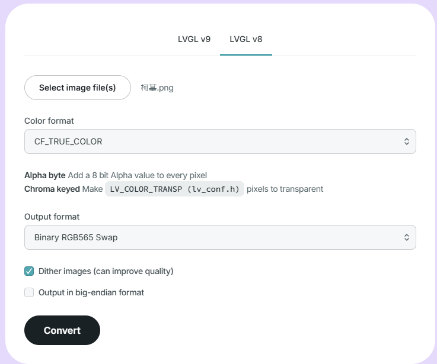
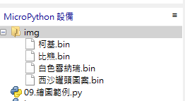
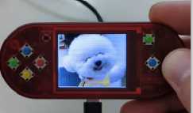

# 09. 畫點、畫線與秀圖

## WiFiBoy 的功用繪圖函式庫

玩學機的基礎繪圖指令，就是利用C語言編寫底層繪圖功能函數，再打包成可被 micropython 使用者直接呼叫使用的函式庫，讓開發者可以專注在開發應用介面。

常用的內建函數有:

* wb.cls([color]) 清除 LCD 螢幕畫面
* wb.box(x, y, w, h, color) 在 LCD 上畫出一個實心的彩色方塊
* wb.line(x1, y1, x2, y2, color[, width]) 在 LCD 上畫出一條彩色的線
* wb.circle(x, y, r, color, [, width]) 在 LCD 上畫一個彩色的空心圓
* wb.pix(x, y, color) 在 LCD 上畫一個彩色的點
* wb.win(x1, y1, x2, y2) 設定一個可填色的範圍(自動換行)
* wb.pushpix(color) 在一個範圍內自動填色
* wb.str(str, x, y[, font[, size]]) 在 LCD 上顯示一個彩色的字符符號
* wb.colors(color1, color2) 設定文字字串顏色
* wb.img(x, y, w, h, buffrt) 將一個bytearray 的圖像快速顯示出來
* wb.showbuf(buffer) 將一個全螢幕的bytearray 圖像快速顯示出來
* wb.showbmp(file) 將一個全螢幕 16bits BMP 格式圖像快速顯示出來

## 程式碼

### 1. 清除畫面，用粉紅色清除畫面

```
wb.cls(wb.PINK)
```

### 2. 清除畫面，用黑色清除畫面，在 (80,64) 畫一個長20,寬20像素的紅色正方形

```
wb.cls()
wb.box(60, 64, 20, 20, wb.RED)
```

### 3. 畫出隨機顏色的線條

```
wb.cls()
W = 160
H = 128
Counter = 0
while Counter < 100:
    x1 = wb.rand(W)
    y1 = wb.rand(H)
    x2 = wb.rand(W)
    y2 = wb.rand(H)
    color = wb.rand(65536)
    width = wb.rand(1, 3)
    wb.line(x1, y1, x2, y2, color, width)
    Counter = Counter + 1
wb.box(0, 100, 160, 20, wb.BLACK)
wb.str("Plot "+ str(Counter) +" lines!", 5, 110, 2, 2)
```

### 4. 做開機畫面

```
wb.cls()
wb.blitpal() 
wb.blitbuf()
wb.blitimg(272, 30, 40, 16, 16)
wb.blitimg(336, 80, 40, 16, 16)
wb.blitimg(340, 100, 40, 16, 16)
wb.blitimg(344, 120, 40, 16, 16)
wb.blitimg(348, 140, 40, 16, 16)
wb.blitstr("ITHome Ironman 2024", 4, 70)
wb.blitstr("DDLab Inc.", 30, 100)
wb.blit()
```

### 5. 展示圖片做成照片瀏覽器

Micropython 要顯示圖檔需要注意幾個地方，請按照下面的步驟處理您的圖片:

1. 將您的圖案轉換成 160 X 128 大小的圖形，可用軟體轉檔，維持圖片比例。
2. 利用轉檔程式，轉換成C格式的點陣檔。




3. 將此檔案透過檔案管理系統上傳到玩學機。
4. 使用 wb.showbuf(您的圖檔) 顯示在螢幕指定位置。




```
import time
wb.cls()
images = ["/img/西沙罐頭圖案.bin", "/img/柯基.bin", "/img/比熊.bin", "/img/白色雪納瑞.bin"]
current_image = 0
while True:
    if wb.getkey() == 1:
        current_image = (current_image + 1) % len(images)
    f = open(images[current_image], "rb")
    data = bytearray(f.read())
    wb.showbuf(data)
    f.close()
    del data
    time.sleep(0.5)
```




[實際執行的影片](/img/09/WiFiBoy_PythonIoT_照片瀏覽.mp4)


## 參考資料

1. [圖檔轉換程式](https://lvgl.io/tools/imageconverter)