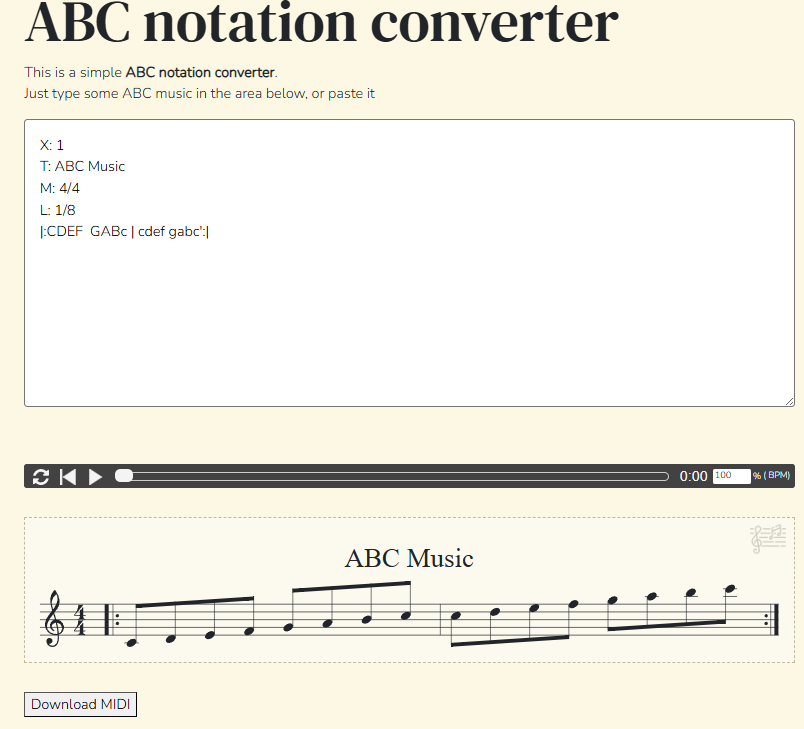

# 19. 玩學機內建的音樂模組

# 樂譜轉換成可撥放字串

台灣使用簡譜習慣使用數字來標記，國外則是使用 ABC Notation，各位讀者可以參考這個 [Nota ABC](https://notabc.app/abc/)網站的教學。


ABC 樂譜是一種用於樂譜的純文字格式。它由 [Chris Walshaw](https://chriswalshaw.co.uk/teaching/) 於 1990 年代初開發，旨在為西方起源的傳統曲調提供一種易於閱讀和編寫的格式。

讀者可以參考 https://notabc.app/abc-converter/ 這個網站的轉換工具



我們用 **小星星** 這首歌來舉例:


```
X:1
T: 小星星
R: reel
M: 4/4
L: 1/4
CCGG |  AAG2 |  FFEE | DDC2:|
w:  一 閃 一 閃 亮 晶 晶, 滿 天 都 是 小 星 星
```


另外也有 abcjs 這樣的 JavaScript 函式庫可以用，您可以在您的網頁裡，加入這樣的工具協助您轉換您想要播放的音樂。


## 玩學運算提供的 toneng 音樂引擎

玩學機主要的發聲器是內建蜂鳴器。如果使用者希望外接音訊，可以透過內建 DAC （左右聲道 Pin 25、26）來發出語音或音樂，但若不希望蜂鳴器發出聲音（干擾），可利用 Pin 17 關閉蜂鳴器。

反過來說，想要聽見buzzer 發出聲音，就要先打開 pin 17 為 high 電位，才能聽見聲音。

如果使用 toneng，使用者不需要像上面 **撥放馬力歐遊戲音樂** 的方式寫這麼多程式，只需要專心把音樂轉成簡譜檔，就能很輕鬆地撥放音效。

Toneng 支援撥放的簡譜規則

* **音階符號**: CDEFGAB   (Do Re Mi Fa So La Si)
* **o + 數字** : o4 代表選擇移動到鋼琴第四組八度音階，O3 就是第三組八度音階。
* **>** : 升一個八度音階
* **<** : 降一個八度音階
* **#** : 加在音階符號後面，代表升半音
* **b** : 加在音階符號後面，代表降半音
* 數字 : 1, 2, 4, 8, 16, 32等數字就是「幾分音符」的意思。 


## 原始程式講解

我們來看看這段非常精練的 toneng 原始碼:

```
# WiFiBoy OK:ESP32 Tone Engine v1.0
# (C) 2020 WiFiBoy Computing Lab, tklua@wifiboy.org

import machine
try: 
    if tone: tone.deinit()
except: tone = machine.Timer(1)
try:
    if snd: snd.deinit()
except: pass
snd=machine.PWM(machine.Pin(25, 3),timer=2)
machine.Pin(17,3).value(1);snd.duty(0)

counter=0;octave=3;tempo=50;nduty=0;ndutyd=15;initduty=90;ps="";playing=0
freq = [round(110*2**(x/12)) for x in range(88)]
def toneEngine(timer):
    global counter,ps,octave,tempo,nduty,ndutyd,playing
    if counter>0:
        counter-=1; nduty-=ndutyd
        if nduty>=0 and nduty<=99: snd.duty(nduty)
        else:snd.duty(0);
    if counter==0:
        if len(ps)>0:
            n = ps[0]; ps=ps[1:]
            if (n>="A" and n<="G") or n==".":
                if n=="A":nn=9
                elif n=="B":nn=11
                elif n=="C":nn=0
                elif n=="D":nn=2
                elif n=="E":nn=4
                elif n=="F":nn=5
                elif n=="G":nn=7
                elif n==".":nn=-99
                if len(ps)>0:
                    if ps[0]=="#": nn+=1; ps=ps[1:]
                    elif ps[0]=="b": nn-=1; ps=ps[1:]
                if len(ps)>0:
                    if ps[0].isdigit(): counter=tempo//int(ps[0]); ps=ps[1:]
                    else:counter=tempo//4
                else: counter=tempo//4
                nduty=initduty
                if nn>=0:snd.freq(freq[octave*12+nn]);
                else: nduty=0; snd.duty(0)
                playing=1
            elif n=="O":octave=int(ps[0]); ps=ps[1:]
            elif n==">":octave+=1
            elif n=="<":octave-=1
            elif n=="T":tempo=int(ps[0:3]); ps=ps[3:]
        else: snd.duty(0); playing=0
    
tone.init(period=10, mode=machine.Timer.PERIODIC, callback=toneEngine)
```

### 初始化和設定

```
import machine              
try: 
    if tone: tone.deinit()
except: tone = machine.Timer(1)
try:
    if snd: snd.deinit()
except: pass
snd = machine.PWM(machine.Pin(25, 3), timer=2)
machine.Pin(17, 3).value(1)
snd.duty(0)
```

* 初始化 tone 和 snd 變數，用於處理 PWM 和定時器。
* machine.Pin(17, 3).value(1) 開啟蜂鳴器
* snd.duty(0) 將 PWM 的佔空比設為 0%。這意味著 PWM 輸出的信號會完全處於低電位，換句話說，就是沒有音效輸出或完全關閉信號。

### 預設參數解釋

```
counter=0;octave=3;tempo=50;nduty=0;ndutyd=15;initduty=90;ps="";playing=0
```

1. counter:

- 用來計數和控制音符的持續時間。當 counter 大於 0 時，音符還在播放。counter 會逐漸減少，直到變成 0，這時音符會停止。

2. octave:

- 目前的音階八度數。音符的音高依據這個八度數來設定。例如，octave=3 表示在第三個八度範圍內播放音符。

3. tempo:

- 音樂的節拍速度，以每分鐘的拍數（BPM, Beats Per Minute）表示。這個數字決定音符的長短，也影響音樂的節奏。

4. nduty:

- PWM 信號的佔空比。這個數值控制音效的強度。數值範圍通常是 0 到 1023。nduty 越大，音效的音量越大。

5. ndutyd:

- nduty 的減少速度，也就是音量變化的速度。當音符結束時，nduty 會以 ndutyd 的速度減少，從而控制音效的消退。

6. initduty:

- 初始的 PWM 佔空比，用來設定音符播放時的初始音量。通常設為較高的值，讓音符剛開始播放時音量較大。

7. ps:

- 儲存音樂的音符序列。這個字串包含了要播放的音符和相關的節拍、八度等資訊。

8. playing:

- 用來指示是否有音符正在播放。當 playing 為 1 時，表示正在播放音符；當 playing 為 0 時，表示沒有音符播放。

### 產出對應 88 鍵鋼琴的音符頻率

```
freq = [round(110*2**(x/12)) for x in range(88)]
```

1. freq:

- 這是一個包含 88 個頻率的列表，用來表示音符 C0 到 C8 的頻率。
round(110*2**(x/12)):

2. 110 是 C#1 的基準頻率，單位是赫茲（Hz）。

- 2**(x/12) 是一個倍頻的計算公式。這是因為音樂的音階是按照 12 平均律來計算的，也就是每隔一個八度，頻率會翻倍。x 是音符的編號，從 0 開始。
round() 函數用來將計算出來的頻率四捨五入到最接近的整數值。

3. for x in range(88):

- 這表示對從 0 到 87 的每個數字 x，都計算一個對應的頻率。
  
4. freq 的範圍:

   * 最小值: 約 27.5 Hz，對應於音符 A0（最底部的 A 鍵）。
   * 最大值: 約 4186 Hz，對應於音符 C8（最上面的 C 鍵）。

### 定義音頻引擎

1. 全域變數:

```
global counter, ps, octave, tempo, nduty, ndutyd, playing
```

定義全域變數這樣能讓 MicroPython 執行時，也能對這些變數進行操作。

2. 音量調整:

```
if counter > 0:
    counter -= 1
    nduty -= ndutyd
    if nduty >= 0 and nduty <= 99:
        snd.duty(nduty)
    else:
        snd.duty(0)
```

* 如果 counter 大於 0，則將 counter 減 1，並減少 nduty（音量的變化量）。
* 根據 nduty 的值調整音量。如果 nduty 在有效範圍內（0 到 99），則設置為該值，否則設置為 0（靜音）。

3. 音符處理:

```
if counter == 0:
    if len(ps) > 0:
        n = ps[0]
        ps = ps[1:]
```

* 當 counter 為 0 時，開始處理音符。
* 取出 ps 字符串的第一個字符 n，並移除 ps 字符串的第一個字符。(即一次處理一個音符)

4. 音符解析:

```
if (n >= "A" and n <= "G") or n == ".":
    if n == "A": nn = 9
    elif n == "B": nn = 11
    elif n == "C": nn = 0
    elif n == "D": nn = 2
    elif n == "E": nn = 4
    elif n == "F": nn = 5
    elif n == "G": nn = 7
    elif n == ".": nn = -99
```

* 根據音符的字母（A 到 G）或休止符（"."）來設定 nn（音符對應的數值）。這些數值用來確定音符在鋼琴上的位置。

5. 音符升降半音:

```
if len(ps) > 0:
    if ps[0] == "#": nn += 1; ps = ps[1:]
    elif ps[0] == "b": nn -= 1; ps = ps[1:]
```

* 根據是否有升記號（#）或降記號（b），來調整 nn 的值。

6. 音符持續時間:

```
if len(ps) > 0:
    if ps[0].isdigit(): counter = tempo // int(ps[0]); ps = ps[1:]
    else: counter = tempo // 4
else: counter = tempo // 4
```

* 根據 ps 字符串中的數字來設定 counter（音符持續時間）。如果沒有數字，則使用預設的持續時間（四分音符）。

7. 設定頻率

```
nduty = initduty
if nn >= 0:
    snd.freq(freq[octave * 12 + nn])
else:
    nduty = 0
    snd.duty(0)
```

8. 撥放狀態:    `playing = 1` ，代表音樂正在播放
9. 特殊命令處理:

```
elif n == "O": octave = int(ps[0]); ps = ps[1:]
elif n == ">": octave += 1
elif n == "<": octave -= 1
elif n == "T": tempo = int(ps[0:3]); ps = ps[3:]
```

* 處理音符命令（如改變八度 O、提高或降低八度 > 和 <、設置節拍 T）。


### 


### 參考資料

1. [上古世紀超大型【作曲攻略】及進階樂譜作曲技巧概念問答貼](https://forum.gamer.com.tw/C.php?bsn=17851&snA=4783)
2. [Nota ABC](https://notabc.app/abc/)
3. [Chris Walshaw](https://chriswalshaw.co.uk/teaching/)