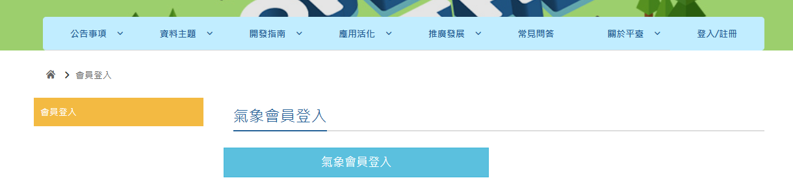
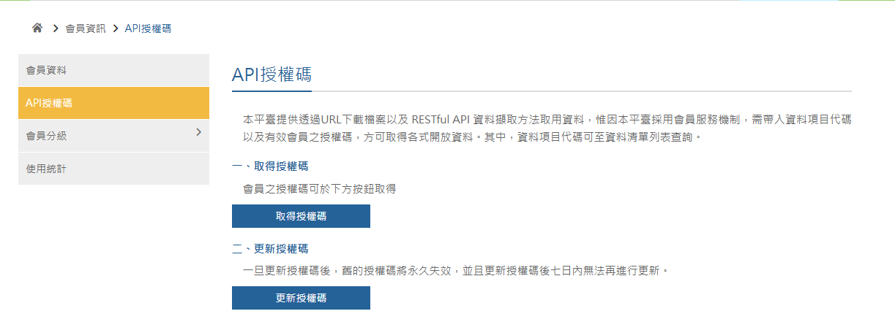
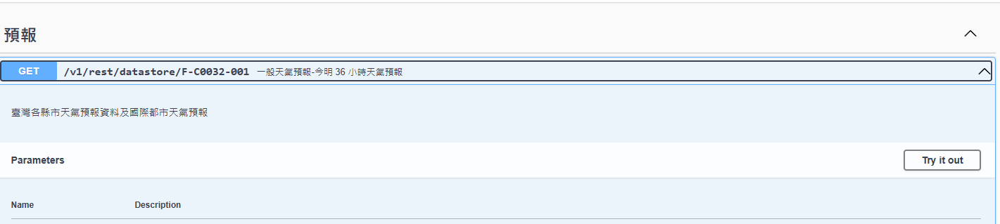
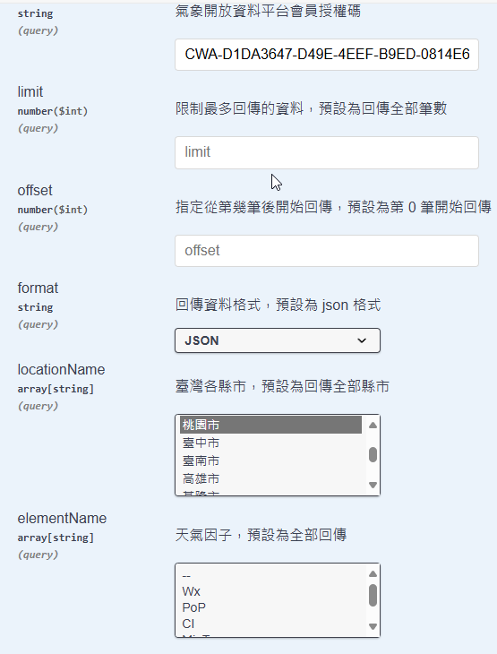
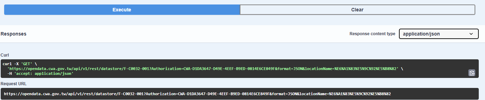
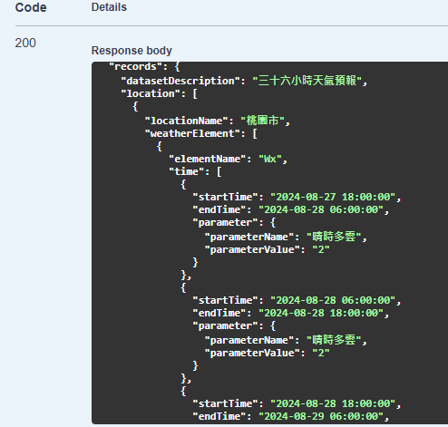
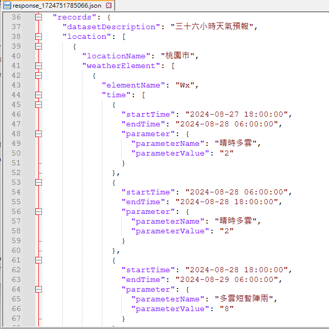

# 29. 自製天氣小時鐘

## OpenData 與天氣資料

中央氣象局提供的 OpenData API 是一個非常方便的工具，允許開發者查詢各種氣象數據。要使用這些 API，需要先了解以下幾個重點：

1. 申請 API 金鑰
   
你必須先在 中央氣象局開放資料平台 註冊帳戶並申請 API 金鑰 (API Key)。這個金鑰會用來認證你的 API 請求。


註冊好帳號後，登入氣象局會員。



點選取得授權碼，會得到一串類似像這樣的字串「CWA-D1DA3647-D49E-YYYY-xxxx-0814E6CE849F」。



2. 選擇適合的 API

中央氣象局提供多種類型的 API，涵蓋天氣預報、即時觀測、雷達圖、地震資訊等。針對你提到的需求，查詢桃園市24小時的天氣預報，可以使用「一般天氣預報-今明 36 小時天氣預報」的 API。



3. 構建 API 請求

你需要構建一個正確的 API URL 請求，包括：

* 基本的 API 路徑
* API 金鑰
* 需要查詢的資料類型和格式



例如，要查詢桃園市的24小時天氣預報，可以使用以下的 API 路徑：

```
https://opendata.cwb.gov.tw/api/v1/rest/datastore/F-C0032-001?Authorization=你的API金鑰&locationName=桃園市
```



- F-C0032-001 是中央氣象局的 36 小時天氣預報資料集編號。
- locationName 用於指定你要查詢的地區，這裡可以填入「桃園市」。
- Authorization 後面是你申請到的 API 金鑰。


4. 處理 API 回應

這個 API 回傳的是 JSON 格式的數據。你需要解析 JSON 數據來獲取你需要的天氣資訊，例如氣溫、降雨機率、天氣現象等。
回傳的 JSON 結構通常包含「地區名稱」、「時間區間」、「天氣描述」等欄位。



使用文字編輯器來查看資料




5. 錯誤處理方式
   
- API 回應時可能會有錯誤，例如錯誤的 API 金鑰、請求過多等。確保在你的程式碼中加入錯誤處理邏輯。
- 遵循 API 的使用限制，避免過度請求，尊重使用條款。


## 範例程式碼


```
import urequests
import wifi
import ujson
# 設定 WiFi 連線參數
SSID = '你家無線網路的SSID'
PASSWORD = '你家無線網路的密碼'
station = wifi.connect(SSID, PASSWORD)
# 中央氣象局查詢
url='https://opendata.cwa.gov.tw/api/v1/rest/datastore/F-C0032-001?Authorization=你的氣象局API&format=JSON&locationName=%E6%A1%83%E5%9C%92%E5%B8%82'

response = urequests.get(url)
data = ujson.loads(response.text)
# print(response.status_code)


location = data["records"]["location"][0]["locationName"]
weatherElements = data["records"]["location"][0]["weatherElement"]
startTime = weatherElements[0]["time"][0]["startTime"]
endTime = weatherElements[0]["time"][0]["endTime"]
weather_state = weatherElements[0]["time"][0]["parameter"]["parameterName"]
rain_prob = weatherElements[1]["time"][0]["parameter"]["parameterName"]
min_tem = weatherElements[2]["time"][0]["parameter"]["parameterName"]
comfort = weatherElements[3]["time"][0]["parameter"]["parameterName"]
max_tem = weatherElements[4]["time"][0]["parameter"]["parameterName"]

result = [location, startTime, endTime, weather_state, rain_prob, min_tem, comfort, max_tem]
print(startTime)
# 命令列印出所有欄位資訊
for i in result:
    print(i)

# 玩學機顯示訊息
wb.cls()
wb.str('Taoyuan', 10, 20, 2, 2)
wb.str('Min Temp: ' + result[5], 10, 40, 2, 2)
wb.str('Max Temp: ' + result[7], 10, 80, 2, 2)
wb.str('Rain %: ' + result[4] + ' %', 10, 100, 2, 2)
```

## 參考資料

1. [中央氣象局開放資料使用手冊](https://opendata.cwa.gov.tw/devManual/insrtuction)
2. [中央氣象署開放資料平臺之資料擷取API](https://opendata.cwa.gov.tw/dist/opendata-swagger.html#/)
3. [ESP32天氣盒子 氣象API串接實作 MicroPython](https://www.youtube.com/watch?v=PIRf2VPDLYw)